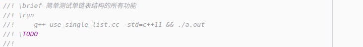
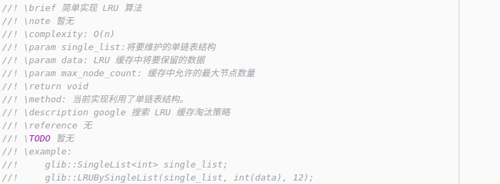

<!--ts-->

### :pencil2: 贡献指导

---

#### 目录

* [1）一般指导](#1一般指导)
* [2）笔记排版](#2笔记排版)
* [3）C++代码格式](#3c-代码格式)
* [4）文件开头标注内容](#4文件开头标注内容)
   * [1 .hpp 文件](#1-hpp-文件)
   * [2 xxx.test.cc 文件](#2-xxx.testcc -文件)
* [5）函数注释说明](#5函数注释说明)
* [6）Pull requests](#6pull-requests)</br></br>


#### 1）一般指导

- 在你决定参与贡献一份新的代码 or 笔记时，请选择好一种数据结构/算法，首先到该 Repo 主目录中 `README.md`  [计划](./README.md/#计划) 一栏，看看是否已经完成过了。如果没有完成过，你需要在 `Issues` 中通知，你将要贡献哪部分代码 & 笔记，前提你要贡献的部分，其他人没有在 `Issues` 中提出过。当然，如果你仅仅提交一份代码 or 笔记时。要在 `Issues` 中，清楚的说明你将要贡献的是代码 or 笔记。最好的贡献方式 — 笔记和代码一起进行提交。除了可以自己负责一部分新的数据结构/算法代码。也可以在已经实现好的数据结构/算法基础上。将其中你认为不太好的地方进行完善，尤其当前实现中包含的 `\TODO` 选项以及 `\Note` 说明部分（这两个说明可以参考  [第  4）部分](#4文件开头标注内容) ）。这两部分可能会包含实现过程中的不足。或者你觉得原作者实现的框架不太好。可以改善一下框架。
- 非常重要的是，贡献的「代码&笔记」要放在同一个文件夹，笔记以算法名字命名，且后缀是 `.md` 。代码通常包含测试文件和算法实现文件。其中测试文件以 `xxx.test.cc` 命名。算法实现文件以 `.hpp` 命名。在你的代码提交之前，要确保代码能够正常运行。并且提供一个专门的测试文件。命名规则 `xxx.test.cc` ，其中 `xxx` 表示算法对应的 `.hpp` 文件名字，测试内容要尽量把所有情况都包含进去，也就是考虑一些边界条件。具体 `.hpp` 文件的注意事项请参照下面  [第  4）部分](#4文件开头标注内容) 。
- 在函数的内部，一些必要部分要加上详细的注释，保证初学者也能够看的懂。 </br></br>


#### 2）笔记排版

在写笔记时，需要了解本文笔记采用的中文排版格式。参照 [中文文案排版指北](https://github.com/sparanoid/chinese-copywriting-guidelines)。</br></br>


#### 3）C++ 代码格式

在写代码过程中，需要参照必要的代码规范，本项目提供了一份关于 C++ 代码规范的简单文档，**戳这里** :point_right::point_right: [CODING_GUIDELINES.md](./CODING_GUIDELINES.md)，同时提供了一份  `.h` `.hpp`，`test.cc` 的模板文件，**戳这里** :point_right::point_right: [template](./template/)，详细的代码规范请参照 [Google C++ Style Guide](https://google.github.io/styleguide/cppguide.html#Header_Files)。中文版本 [点击这里](https://zh-google-styleguide.readthedocs.io/en/latest/google-cpp-styleguide/)。或者查看 `code-style` 文件夹中对应的代码规范笔记。**戳这里** :point_right::point_right: [code-style](./code-style/)。，</br></br>


#### 4）文件开头标注内容

贡献的代码，其中测试文件以 `xxx.test.cc` 命名。算法实现文件以 `.hpp` 命名。并且开头部分按照如下格式进行书写。标准格式如下：

```c++
/*
 * CopyRight (c) 2019 gcj			 // 在后面添加上你的署名 
 * File: single_list.hpp 			 // 该算法对应的名字，以小写+下划线形式命名
 * Project: algorithm
 * Author: gcj 								 // 你自己的署名
 * Date: 2019/4/8 						 // 修改成当前文件创作完成时的日期
 * Description: single linked list simple implementation // 简单描述文件包含的算法
 * License: see the LICENSE.txt file
 * github: https://github.com/saber/algorithm
 */
```

除了上面的共同开头部分，在 `.cc` 和 `.hpp` 文件中分别包含单独的说明。

##### 1 .hpp 文件

在每个 `.hpp` 文件开头部分，要包含以下几部分（至少包含前四个），示例图片如下。

- `\brief`

  描述当前实现文件对应的功能。比如说明一下实现了一个什么算法。包含的功能有哪些。对应的函数名字是什么。

- `\Note`

  在使用该算法时需要特别注意的，或者其他一些注意事项。

- `\TODO`

  该文件还没有完成的一些功能，或者一些将来需要改进的地方。

- `\platform`

  描述当前代码能够通过的测试平台。标注哪个平台的编译器及其版本信息。

- `\TODO Reference`

  为完成 `\TODO` 留下的任务，将会参考的资料。

- `\conclusion`

  可能会从试验结果/实现方式中总结的一些结论。

</br></br>


##### 2 xxx.test.cc 文件

在对应的 `xxx.test.cc` 文件开头部分，要包含以下几个部分（至少包含前两个），示例图片如下

- `\brief`

  描述当前文件的功能。

- `\run`

  如何运行当前测试代码。比如我的在 ubuntu16.04 平台下，可以在终端中输入如下命令即可运行测试代码。

  `g++ use_xxx.cc -std=c++11 && ./a.out` 

- `\TODO`

  主要描述一下，还没有/将要进行测试的内容。

- `\conclusion`

  如果在测试时，有一些对比实现，那么如果得到了一些结论，可以在这里写上一些结论。比如我在 `use_sort.cc` 中进行了 6 种排序算法的测试。得到了 6 种不同的运行时间。可以从时间执行的长短中得到某排序算法在某个情况下运行效率最高。

</br></br>


#### 5）函数注释说明

算法核心函数处，为了保证初学者能够看懂，需要有一些注释说明，通常包含下面几部分（至少包含前面三个）。当然其他部分的说明在必要时也需要加入。比如，除了核心算法外，还有一些应用例子函数，需要在应用例子函数处，加入 `\description`  选项，详细描述一下该问题是什么。如果当前函数的实现还不完美，可以加入 `\TODO` ，表示接下来要做的工作。如果某个部分没有对应的说明，可以省略不写。示例图片如下。

- `\brief` 

  简单描述当前函数的功能，如果该问题比较复杂，可以通过下面的 `\description` 单独额外进行补充说明。

- `\note`

  使用过程中需要的注意事项以及一些其他重要的说明。

- `\complexity`

  标注当前核心算法的时间复杂度、空间复杂度。如果空间复杂度比较简单可以不写。对于时间复杂度，如果最好情况、最坏情况、平均情况的时间复杂度会有不同，需要分别标注出不同的时间复杂度。

- `\param`

  形式参数的说明，如果简单，可以不加。

- `return`

  返回值，如果简单，可以不加。

- `\method`

  如果对于同一功能函数，使用了多个方法，可以分别描述一下当前实现所用的什么方法，比如可能用了递归，另一个方法用了循环。如果仅仅一个实现且该方法比较有技巧或者难理解，这里可以添加标注，介绍一下该方法的具体过程。

- `\description`

  可以描述当前应用程序是解决什么问题，对问题做一些简单的描述。或者给出外部链接。

- `\reference`

  实现过程中，如果参考了其他人的实现代码，可以给出外部链接。

- `\TODO`

  描述当前实现，还需要做什么改进。

- `\example`

  如果该函数使用方法可能会让初学者不太了解，可以自己举个例子。

</br></br>


#### 6）Pull requests 

为了能让你的工作合并到当前项目中，你需要按照如下的方式进行操作。

- [Fork](https://help.github.com/en/articles/fork-a-repo) 当前仓库，然后在自己的 GitHub 主页中，克隆刚刚 fork 过的项目。然后按照下面进行远程配置。

  ```shell
  # 克隆自己 fork 过的仓库
  git clone https://github.com/<your-username>/algorithm.git
  cd algorithm
  # 添加原始仓库，也就是当前仓库，保持与 "upstream" 一致，也就是与当前仓库一致
  git remote add upstream https://github.com/saber/algorithm.git
  ```

- 如果你的本地仓库很长时间之前下载过的，现在想起来要开发一下新的数据结构与算法，这时很可能与当前项目仓库不一致，那么需要同步更新下。

  ```shell
  // 从上游获取最新更新，也就是从当前项目中获取最新提交
  git fetch upstream
  // 切换到你的本地 master 分支
  git checkout master
  // 合并刚刚从上游获取的更新
  git merge upstream/master
  ```

  或者直接使用如下命令

  ```shell
  git checkout master
  git pull upstream master
  ```

- 在 master 分支下，建立一个自己的开发分支，比如叫做 `dev`，然后在该分支下进行一些新的数据结构与算法的开发。可以在自己的分支下进行多次提交。

  ```shell
  git checkout -b dev
  ```

- 在自己的开发分支 `dev` 开发完毕后，你可能会有一系列的提交，此时 git log 后的提交历史会有分叉，不太美观，在把你的新的数据结构与算法开发之前，需要将这些分叉整理成一条直线。使用下面命令。

  ```shell
  // 整理当前分支为一条直线
  git rebase
  ```

- 完成独立开发后，在推送到远程之前，为了防止之后的合并冲突，你需要在本地合并上游远程分支到当前的 `dev` 分支，保持与原始项目最新状态同步。这里 `--rebase` 是为了保持 log 成一条直线。

  ```shell
  git pull [--rebase] upstream master
  ```

- 推送你本地 `dev` 分支到远程的 `master` 分支。

  ```shell
  git push origin dev:master
  ```

- 跳转到 GitHub  你自己仓库对应的项目主页，点击 `New pull request` 按钮。输入合适的标题和一些提交描述。

<!--te-->
