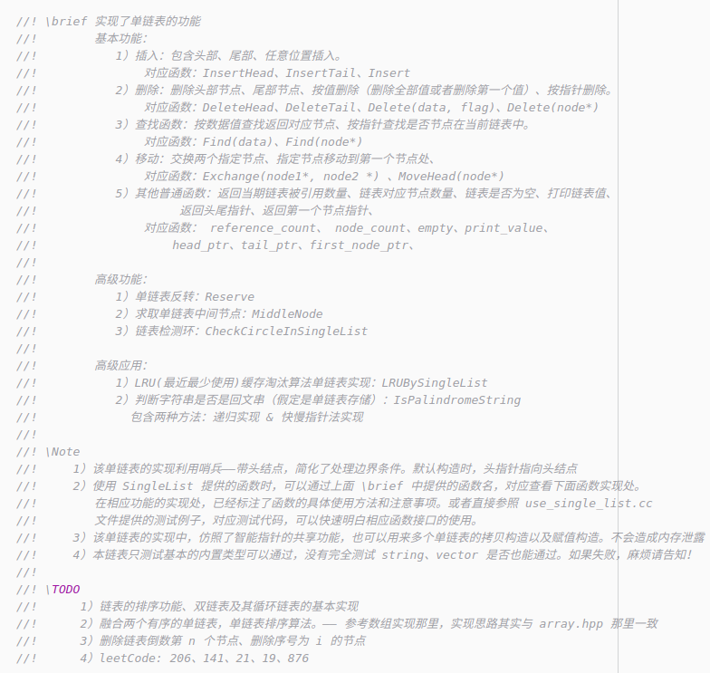

<div align = "center"> </div><br>

> 记录学习《数据结构与算法之美》专栏的实现代码（C++）& 笔记。

[](https://github.com/saber/algorithm/issues) [](https://github.com/saber/algorithm/network) [](http://img.shields.io/github/saber/algorithm/stargazers) [](https://travis-ci.org/saber/algorithm) [](https://github.com/saber/algorithm/releases)[](README.md)</br></br>

---


## :open_file_folder: src

专栏中讲过的数据结构与算法的 C++ 实现。内部包含了详细的代码注释、复杂度分析以及基本实现思路等等。下面图片是其中单链表 `.hpp` 注释例子。代码风格参照 [Google 代码风格 — 笔记](./code-style/)。一份在学习 Google 代码规范时，以代码形式简单整理的笔记。

查看该 Repo 当前包含的数据结构与算法相关的代码，**戳这里**​ :point_right: :point_right: [代码](/src)。

**代码持续更新中 ......**

</br></br>


## :notebook: notes

为方便阅读学习过程中的笔记，笔记已经按照中文排版格式进行排版。排版格式参照 [中文文案排版指北](https://github.com/sparanoid/chinese-copywriting-guidelines)。

阅读笔记，**戳这里**​ :point_right: :point_right: [笔记](notes/)。

**笔记持续更新中 ......** </br></br>


## :open_file_folder: code-style

该文件夹包含了代码规范笔记，这些笔记是 Google 代码规范的浓缩形式，该笔记与上面记录数据结构与算法的笔记不同，是以代码形式呈现的笔记。本 Repo 包含的代码，都是根据这些规范进行书写。当然这份规范笔记还有许多不足，会随着笔者的 C++ 水平的提升而进行改进。同时自己也简单整理了一份规范文档，适用于本项目的源码。**戳这里** :point_right: :point_right: [CODING_GUIDELINES.md](CODING_GUIDELINES.md)。这份文档配合 `template` 文件夹内部的两个文件 `template.h` `template.test.cc` 一起查看，效果更佳。

更多的代码风格，请参照 [Google C++ Style Guide](https://google.github.io/styleguide/cppguide.html)。中文版本 [点击这里](https://zh-google-styleguide.readthedocs.io/en/latest/google-cpp-styleguide/)。

**代码规范持续更新中 ......** </br></br>


## :pencil2: awesome-resources.md

学习过程中收集的关于数据结构与算法的资源，以及大佬经验。

**戳这里** :point_right: :point_right: [awesome-resources.md](awesome-resources.md)。

**资源持续更新中 ......** </br></br>


## :open_file_folder: practice

本文件夹包含了数据结构与算法对应的练习题及笔记，**戳这里**:point_right: :point_right: [实战](practice/) 。笔记内容清晰标记了复杂度、实现思路及具体实现代码，题目分类来源于 [LeetCode](https://leetcode.com/problemset/all/)。

**持续更新中 ......** </br></br>


## :open_file_folder: template 

包含了当前项目中，一份源码规范的简单模板。是该 Repo 中源文件和头文件遵循的一些简单规则，并且以代码形式展现出来。除了上面 `code-style` 标题介绍的代码规范笔记。同时自己也简单整理了一份规范文档。**戳这里** :point_right: :point_right: [CODING_GUIDELINES.md](CODING_GUIDELINES.md)。这份文档配合 `template` 文件夹内部的两个文件 `template.h` `template.test.cc` 一起查看，效果更佳。

**持续更新中 ......** </br></br>


## :black_nib: 计划

本 Repo 中， `src`文件夹包含的代码实现，基本上是按照如下列表顺序进行更新。已经完成的会进行特殊标注，除了下面一些数据结构与算法，还会包含一些专栏中涉及到的高级算法实现。如果你觉得某个/些算法也可以加入其中，不妨创建一个 `issue` ，我会把他添加到这里。

##### 数组

- [x] 实现一个支持动态扩容的数组 
- [x] 实现两个有序数组合并为一个有序数组
- [ ] 实现一个大小固定的有序数组，支持动态增删改操作 

##### 链表
- [x] 实现单链表，支持增删操作
- [ ] 实现循环链表、双向链表，支持增删操作
- [x] 实现单链表反转
- [ ] 实现部分单链表翻转
- [ ] 实现两个有序的链表合并为一个有序链表
- [x] 实现求链表的中间结点
- [x] 链表检测环
- [x] 单链表实现 LRU 缓存淘汰策略

##### 栈
- [x] 用数组实现一个顺序栈

- [x] 栈在表达式求值中的应用，及其在消消乐中的应用

- [ ] 用链表实现一个链式栈
- [ ] 编程模拟实现一个浏览器的前进、后退功能

##### 队列
- [x] 用数组实现一个顺序队列
- [ ] 用链表实现一个链式队列

- [x] 数组实现一个循环队列

##### 递归
- [x] 编程实现斐波那契数列求值f(n)=f(n-1)+f(n-2)

- [x] 最终推荐人检测环 A-B-C-A

- [ ] 编程实现求阶乘n!
- [ ] 编程实现一组数据集合的全排列

##### 排序
- [x] 实现归并排序、快速排序、插入排序、冒泡排序、选择排序

- [x] 编程实现O(n)时间复杂度内找到一组数据的第K大元素

##### 二分查找

- [x] 实现一个有序数组的二分查找算法
- [x] 实现模糊二分查找算法（第一个等于给定值、最后一个等于给定值、第一个大于等于给定值、最后一个小于等于给定值）
- [x] 循环有序数组查询指定值

##### 跳表

- [x] 跳表实现

##### 散列表
- [x] 实现一个基于链表法解决冲突问题的散列表
- [x] 实现一个 LRU 缓存淘汰算法

##### 字符串
- [ ] 实现一个字符集，只包含a～z这26个英文字母的Trie树
- [ ] 实现朴素的字符串匹配算法

##### 二叉树
- [x] 实现一个二叉查找树，并且支持插入、删除、查找操作
- [ ] 实现查找二叉查找树中某个节点的后继、前驱节点
- [x] 实现二叉树前、中、后序以及按层遍历

##### 堆
- [x] 实现一个小顶堆、大顶堆（默认就是一个简单版的优先级队列）
- [ ] 优先级队列
- [x] 实现堆排序
- [ ] 利用优先级队列合并K个有序数组
- [ ] 求一组动态数据集合的最大Top K

##### 图
- [ ] 实现有向图、有权图、无权图的邻接矩阵和邻接表表示方法
- [x] 实现无向图邻接表表示方法
- [x] 实现图的深度优先搜索（递归+非递归）、广度优先搜索
- [ ] 实现Dijkstra算法、A*算法
- [ ] 实现拓扑排序的Kahn算法、DFS算法

##### 回溯
- [x] 利用回溯算法求解八皇后问题
- [x] 利用回溯算法求解0-1背包问题
- [x] [不同路径问题](https://leetcode-cn.com/problems/unique-paths-iii/)

##### 分治
- [x] 利用分治算法求一组数据的逆序对个数

##### 动态规划
- [ ] 0-1背包问题
- [ ] 最小路径和
- [ ] 编程实现莱文斯坦最短编辑距离
- [ ] 编程实现查找两个字符串的最长公共子序列
- [ ] 编程实现一个数据序列的最长递增子序列</br></br>


### ~~如何贡献自己的代码&笔记~~（暂时不开放贡献，还没有完善好一些东西，后期会开放......）

---

~~按照下面的步骤，即可贡献自己的代码&笔记。在此之前，你需要了解贡献规则，**戳这里** :point_right::point_right: [贡献](./CONTRIBUTION.md)。~~

~~1）**Fork** 当前项目~~

~~2）创建一个分支，增加一份「代码 & 笔记」，但是不包含当前项目中已经存在的，你可在上面计划列表中寻找一个未完成的目标。~~

~~3）最后一步是 **pull request**（确保内容格式符合贡献规则）~~</br></br>

 

## :memo: 后记

### QQ 群

专栏推荐的课本资源大概 1GB，因为 Git 上传限制以及 CSDN 同时不能自己设置 0 积分。如果想获取该资源，直接到 CSDN 平台下载（[资源链接1](https://download.csdn.net/download/geself/11152111) ，[资源链接2](https://download.csdn.net/download/geself/11152094)，[资源链接3](https://download.csdn.net/download/geself/11152117)），可能会花费你的很多积分，本来想设置成 0 积分免费分享给大家。目前由于 CSDN 改版，这个积分会由 CSDN 平台算法自动制定，个人没有权限设置 0 积分。如果没有积分，可以免费下载上述资源，也就是申请加入下面的群，到 qq 群进行下载。建立 qq 群的目的有两个，一方面，该平台不限制文件时间，可以随时下载资源。另一方面，这也为大家提供一个学习交流平台，在这里你可以自由地讨论技术问题。其中一些聊天记录，都可以拓展自己的视野，相比于微信群，qq 群能够长久保存，方便你及时回顾，寻找当前遇到问题的解决方案。当然，如果你有更合适的免费资源上传和下载的地方。希望能够及时告知，我会把资源放在上面（百度云除外，下载/上传都太慢......）。

**Note**：为了保证群内不出现微商等闲杂人员，申请加群时，要备注成 saber/algorithm 等字眼，方便筛选。

</br></br>


### Repo 总览

```
.
├── awesome-resources.md
├── code-style
│   ├── google_norm.cc
│   ├── google_norm.h
│   └── README.md
├── CODING_GUIDELINES.md
├── LICENSE.txt
├── notes
│   ├── pics
│   ├── README.md
│   ├── 递归.md
│   ├── 堆&应用.md
│   ├── 队列.md
│   ├── 二分查找.md
│   ├── 复杂度分析.md
│   ├── 哈希算法.md
│   ├── 排序.md
│   ├── 散列表.md
│   ├── 数组&链表.md
│   ├── 树.md
│   ├── 跳表.md
│   └── 栈.md
├── pics
│   ├── cc文件格式.png
│   ├── logo2.png
│   ├── qq.png
│   ├── 函数注释说明.png
│   └── 注释格式.png
├── practice
│   ├── array
│   └── README.md
├── README.md
├── src
│   ├── array
│   ├── binary_search
│   ├── hash_table
│   ├── heap
│   ├── internal
│   ├── list
│   ├── queue
│   ├── README.md
│   ├── recursion
│   ├── skip_list
│   ├── sort
│   ├── stack
│   ├── stl_examples
│   ├── tree
│   └── utils
└── template
    ├── other_type.h
    ├── README.md
    ├── template.hpp
    ├── template.md
    └── template.test.cc
```

