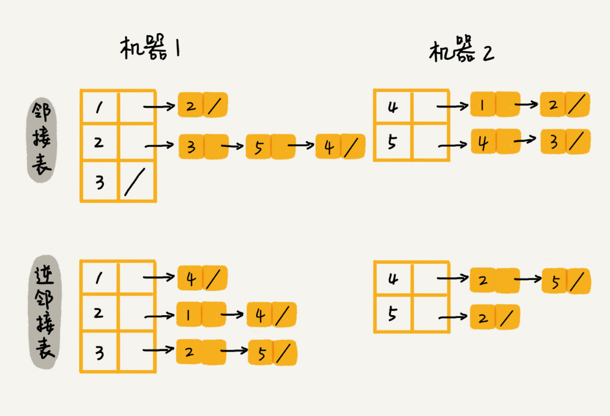
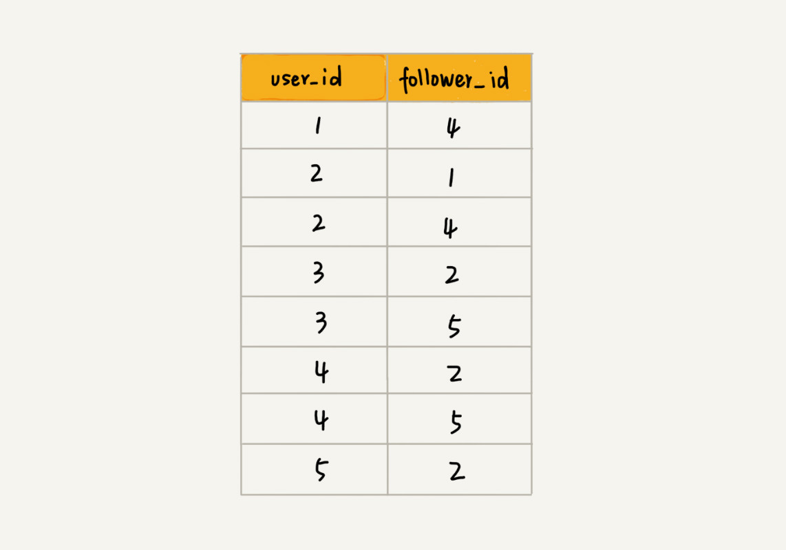

<!--ts-->

图

 * [一、什么是图](#一、什么是图)
 * [二、为什么要用图](#二、为什么要用图)
 * [三、如何使用图结构](#三、如何使用图结构)
    * [1 如何存储图](#1 如何存储图)
       * [1 邻接矩阵](#1-邻接矩阵)
       * [2 邻接表](#2-邻接表)
    * [2 图的应用例子](#2-图的应用例子)
 * [四、图的暴力搜索算法](#四、图的暴力搜索算法)
    * [1 广度优先搜索](#1-广度优先搜索)
    * [2 深度优先搜索](#2-深度优先搜索)
    * [3 适用范围](#3-适用范围)

### 一、什么是图

---

如何存储微博、微信等这些社交网络的好友关系？

图是一种非线性表数据结构，顶点与顶点以及之间的连线构成一个图结构，根据边是否有方向，分为有向图和无向图。

度（degree）：跟顶点相连接的边的条数

 
   

 

本图片来自极客时间《数据结构与算法之美》专栏
 

入度（In-degree）：指向该顶点的边的条数

出度（Out-degree）：从该顶点出发的边的条数

带权图（weighted graph）：每条边都有一个权重，比如可以表示 QQ 好友间的亲密度

 
   

 

本图片来自极客时间《数据结构与算法之美》专栏
 

### 二、为什么要用图

---

图中边和顶点可以表示应用场景的两个对象以及对象之间的联系，抽象的表达可以解决许多类似的问题，比如 QQ 微信 微博的的社交关系就用图来表示。

### 三、如何使用图结构

---

#### 1 如何存储图

##### 1 邻接矩阵

用一个二维数组来表示，数组元素 $a[i][j]$ 表示顶点 i 和顶点 j 之前的联系（根据图的分类：有向图、无向图、带权无向图）。如下图所示，无向图会浪费空间，但是简单直接，一些问题可以转换为矩阵的乘法！

 
   

 

本图片来自极客时间《数据结构与算法之美》专栏
 

##### 2 邻接表

 
   

 

本图片来自极客时间《数据结构与算法之美》专栏
 

1 对应的链表表示，1 指向了 2，不过这样查找速度比较慢，可以将链表替换成平衡二叉搜索树（实际使用可以用红黑树），在查询的时候就有 logn 的速度找到 2 和 4 之间是否有联系。还可以用跳表或者动态的有序数组使用二分搜索，都可以有 logn 的速度进行快速查询！

#### 2 图的应用例子

比如微博的关系图，我们先根据微博期望支持的操作，来选定什么样的存储结构

- 判断用户 A 是否关注了用户 B

- 判断用户 A 是否是用户 B 的粉丝
- 用户 A 关注用户 B
- 用户 A 取消关注用户 B
- 根据名称的首字母排序，分页获取用户的粉丝列表
- 根据用户名称的首字母排序，分页获取用户的关注列表

根据这些操作，可以选定用邻接表方式（假定在内存中处理这些数据），根据 A 关注 B，A 是否是 B 的粉丝，此时就需要两个邻接表，一个是存储顶点向外指向的关系，另一种是存储指向该顶点的关系。后面又说根据首字母排序，那么说明邻接表每个位置不能用链表存储，应该使用比较快的查询、插入、删除的动态数据结构，比如可以用跳表，复杂度为 $O(logn)$，并且还是有序的存储。如果数据量太大，可以根据哈希算法分片到不同的机器上，然后根据顶点编号计算哈希值，之后到对应的机器上获取即可，如下图

 
   

 

本图片来自极客时间《数据结构与算法之美》专栏
 

如果不在内存中存放这些数据，我们也可以用数据库来存储这些数据，然后直接建立一个表，如下图所示，这里以逆邻接表为例，直接记录了 1 对应了 4，然后 2 对应了 1, 4。这样空间占用比较高，适合存储永久型数据。 

 
   

 

本图片来自极客时间《数据结构与算法之美》专栏
 

### 四、图的暴力搜索算法

---

给你一个用户，如何找出这个用户的所有三度（其中包含一度、二度和三度）好友关系？

下面两种方法既可以用在无向图，也可以用在有向图上。都是不带权重的图

#### 1 广度优先搜索

一种层层推进的搜索策略，因为内部用邻接表来表示，所以每一层表示一个顶点对应的所有邻接表顶点。实现过程中需要记录访问过的顶点，以及搜索的路径，还有一个队列，保存与当前顶点相连的下一层顶点。

 
   

 

本图片来自极客时间《数据结构与算法之美》专栏
 

**时间复杂度**：最坏情况，每个顶点都需要进入队列一次，每条边也需要访问一次，那么复杂度为 O(V+E)，对于一个连通图中（任意两个顶点都是联通的），边数一定大于顶点数 - 1，所以广度优先算法也可以协成 O(V)。

**空间复杂度**：空间消耗主要在 visited 数组、queue 队列、prev 数组上，所以空间复杂度为 O(V)。

#### 2 深度优先搜索

利用一种回溯的思想，就是以深度优先的方式搜索整个解空间，在搜索过程中用剪枝函数，避免无效的搜索。这里深度优先就用了一个数组，来记录该顶点是不是被访问过。相当于剪枝函数，解空间应该是从起点能够终点的搜索可达路径。

**时间复杂度**：最坏情况下，每条边被访问了两次（包含回退），因此时间复杂度是 O(E)。

**空间复杂度**：与广度优先一致，要包含 visited、prev 数组和递归调用栈，递归调用深度最大不会超过顶点的个数，总空间复杂度就是 O(V)。

#### 3 适用范围

这两种搜索算法是图上最基本的最常用的，但是因为是穷举法，所以仅仅适用于状态空间不大的情况（图不大），广度优先需要借助队列来实现，深度优先需要借助栈来实现。两者的时间复杂度都是 O(E)，空间复杂度都是 O(V)。