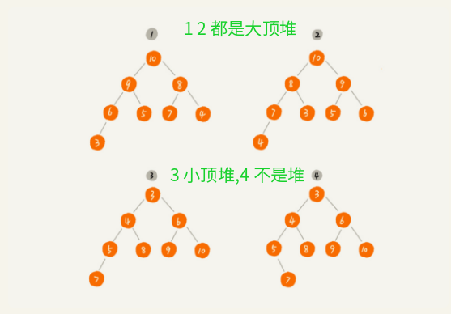
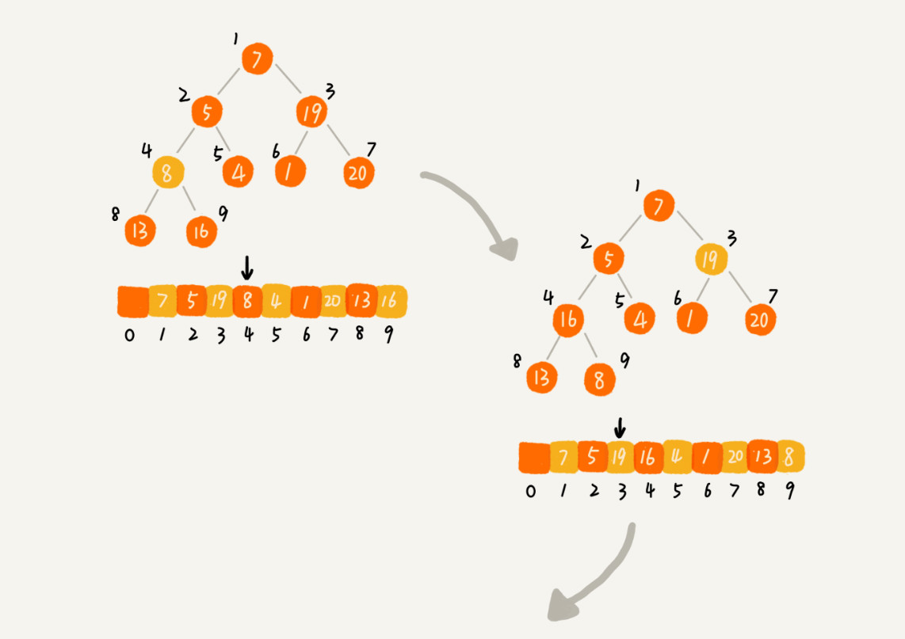
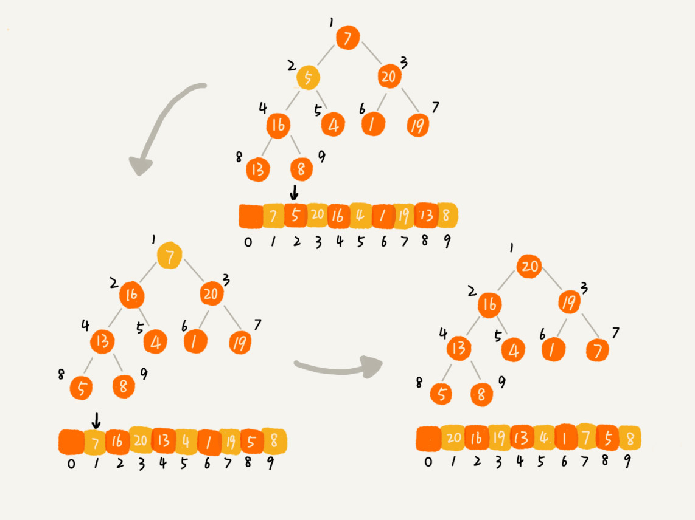
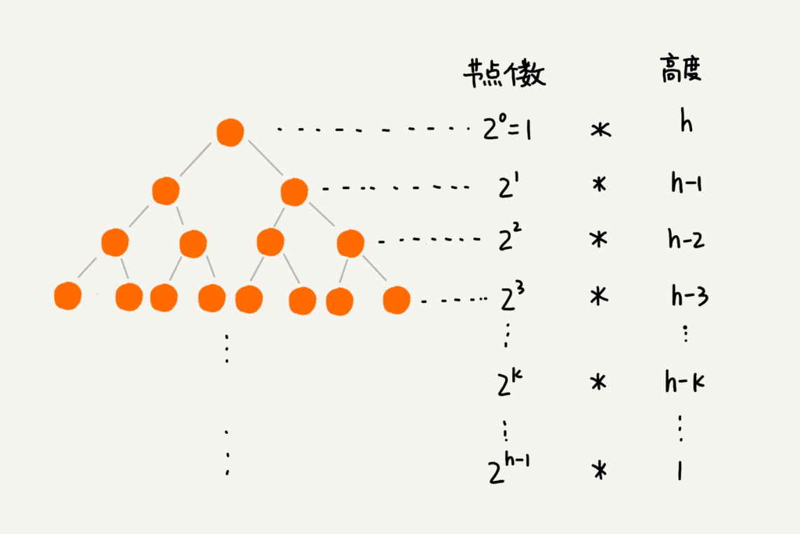
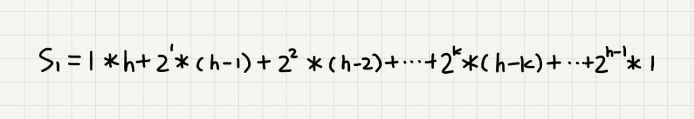
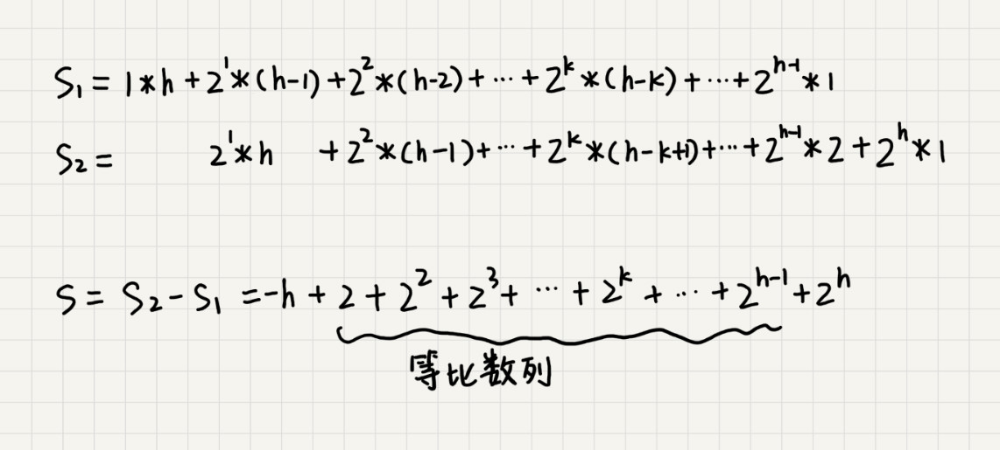
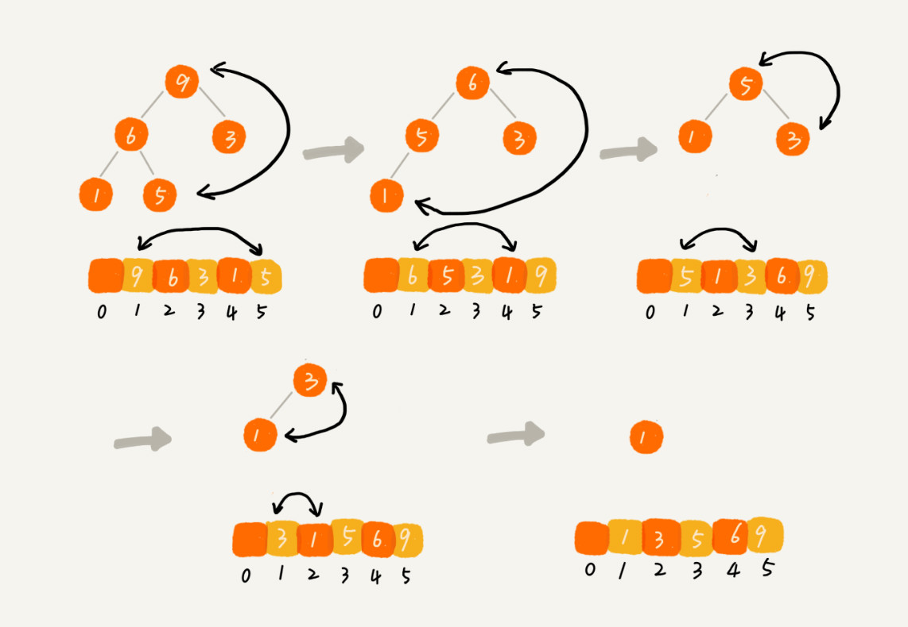

<!--ts-->

堆&应用

* [一、什么是堆](#一什么是堆)
* [二、为什么用堆](#二为什么用堆)
* [三、如何实现堆](#三如何实现堆)
   * [1 堆化（heapify）及其方法](#1-堆化heapify及其方法)
   * [2 删除堆顶元素](#2-删除堆顶元素)
   * [3 堆化的时间复杂度](#3-堆化的时间复杂度)
* [四、堆的应用——排序](#四堆的应用排序)
   * [1 建堆](#1-建堆)
   * [2 建堆复杂度](#2-建堆复杂度)
   * [3 排序](#3-排序)
   * [4 整个排序时间复杂度](#4-整个排序时间复杂度)
   * [5 为什么快排要比堆排序性能好？](#5-为什么快排要比堆排序性能好)
   * [6 思考题](#6-思考题)

- [五、堆的应用——优先级队列](#五、堆的应用——优先级队列)
  - [1 合并有序小文件](#1 合并有序小文件)
  - [2 高性能定时器](#2 高性能定时器)
- [六、堆的应用——求 Top K](#六、堆的应用——求 Top K)
  - [1 静态数据](#1 静态数据)
  - [2 动态数据](# 2 动态数据)
- [七、堆的应用——求中位数](#七、堆的应用——求中位数)
  - [1 静态数据](#1 静态数据)
  - [2 动态数据](#2 动态数据)
- [八、课后思考及习题](#八、课后思考及习题)

#### 一、什么是堆

---

在实际的软件开发中，快速排序的性能要比堆排序好，这是为什么呢？

不是稳定的排序算法！

一种特殊的树

- 满足完全二叉树
- 堆中每一个节点的值都必须大于等于（或小于等于）其子树中每个节点的值。根据大于等于或者小于等于可以分为大顶堆和小顶堆

 
   

 

本图片来自极客时间《数据结构与算法之美》专栏
 

#### 二、为什么用堆

---

数据结构简单（数组），不需要存储指针，节省了大量的空间，并且仅通过数组下标就可以找到左右儿子节点。其应用场景多，经典有堆排序（原地的、时间复杂度为 $O(nlogn)$）

#### 三、如何实现堆

---

需要了解关于堆的两个内容。

- **堆都支持那些操作**：堆中插入元素（需要堆化）及从堆顶删除一个元素（同样需要堆化）
- **如何存储一个堆**：数组，1 为树根节点，2xi 是左子节点，2xi+1是右节点，i/2 是父节点，此时的堆浪费一个空间，如果选取 0 作为根节点，那么 2xi + 1是左叶子节点，2xi + 2 是右节点。这个操作起来就不是那么好，所以选择浪费一个空间即可！

**Note** 下面方法以大顶堆为例

##### 1 堆化（heapify）及其方法

- 从下向上

  将新来数据放在数组最后，然后和其父节点值进行比较，如果大于父节点值，那么两者进行值交换，然后再次与父节点进行比较，直到到达堆顶或者其值小于父节点值。

 
   

 

本图片来自极客时间《数据结构与算法之美》专栏
 

- 从上向下

  与上面类似，只不过以当前节点为关注节点，依次与自己的两个儿子节点进行比较，如果该节点的值小于最大儿子节点值，那么两者进行交换，直到满足到达叶子节点或者不满足交换条件为止。

##### 2 删除堆顶元素

如果直接删除堆顶元素，然后从上向下堆化会出现数组中的某个空间空洞，此时整个树就不是完全二叉树。如下

 
   

 

本图片来自极客时间《数据结构与算法之美》专栏
 

解决方法，就是把堆的最后一个节点值替换到堆顶，然后再次进行从上到下的堆化即可。

 
   

 

本图片来自极客时间《数据结构与算法之美》专栏
 

##### 3 堆化的时间复杂度

包含 n 个节点完全二叉树高度为 $log_2n$ ，堆化过程是按照节点路径依次进行比较的，所以堆化时间复杂度与树的高度成正比 $O(logn)$。

#### 四、堆的应用——排序

---

**结论**：时间复杂度为 $O(nlogn)$，空间复杂度为 O(1)。该排序算法时间复杂度非常稳定。

需要如下两个步骤

- 建堆
- 排序

##### 1 建堆

- 把数组的 index=1 的位置作为堆顶，然后从第二个元素开始将这些元素插入这个堆，堆化方法是从下向上。
- 从后向前处理数据，在第一个不是叶子节点的位置开始（n/2），从上向上下进行堆化。（n/2 + 1 开始到 n 都是叶子节点）

 
   
  

 

本图片来自极客时间《数据结构与算法之美》专栏
 

##### 2 建堆复杂度

因为每个节点的交换次数与该节点的高度成正比，那么我们只需要把数组中的每个节点的高度全部加起来就可以得到这个树的总共的交换次数。那么时间复杂度就可以得到了。

 
   

 

本图片来自极客时间《数据结构与算法之美》专栏
 

从图可以看出，最后第二层节点对应高度为 1，节点个数为 $2^{h-1}$，用每层节点个数乘以对应高度求和，把公式两边乘以 2 然后减去 S1 就得到最后的和

 
   
   
   

 

本图片来自极客时间《数据结构与算法之美》专栏
 

此时将 $h = log_2n$ 代入 S 的公式中，就可得到建堆的时间复杂度为 $O(n)$。

##### 3 排序

由堆的特性我们知道，最顶部的数据是最大数据，那么把堆顶数据和最后一个数据交换，然后对剩下的 1-n-1 个元素进行堆化，从新建立一个新的大小为 n-1 的堆，实际上就是对第 1 个堆顶元素进行从上到下的一次堆化，这样再次把最大的元素放到数组的倒数第 2 个位置，之后在堆化一次，建立新的堆。直到将要堆化的数组大小为 1。

 
   

 

本图片来自极客时间《数据结构与算法之美》专栏
 

##### 4 整个排序时间复杂度

建堆 $O(n)$ ，排序是 $O(nlogn)$，因为每次堆化都是在堆顶开始，一次堆化的时间复杂度为 $logn$，那么需要对 n 个元素都做一遍堆化，那么复杂度为 $O(nlogn)$ 。

##### 5 为什么快排要比堆排序性能好？

- 堆排序数据的访问方式没有快速排序友好（CPU 缓存方面）
- 对于同样的数据，排序过程中，堆排序算法的数据交换次数要多余快速排序（建堆过程会打乱逆序度）

但是快排只能适合静态数据！

##### 6 思考题

1. 堆排序过程中，建堆时，对于完全二叉树，下标从 n/2 + 1 到 n 的都是叶子节点，这个结论是如何推导出来的？

   因为最大叶子节点下标为 n，那么其父节点为 n/2，所以在 n/2 + 1 之后的节点都是叶子节点。

2. 堆的其他应用？
   - 从最大数量级数据中筛选出 top n 条数据。
   - 优先级队列（c++ 中的 priority_queue）

#### 五、堆的应用——优先级队列

---

假设现在我们有一个包含 10 亿个搜索关键词的日志文件，如何能快速获取到热门榜 Top 10 的搜索关键词呢？

先将日志文件分片存储在 10 个文件夹，根据哈希算法（计算每个数据的哈希值），按照得到的哈希值 /10 将一些关键词放到 10 个文件夹中，然后对每个文件夹子统计 TOP k，最后对 10 个文件中的 TOPK 进行合并即可！

应用场景非常多：赫夫曼编码、图的最短路径、最小生成树算法。

##### 1 合并有序小文件

每个小文件依次从头取出元素，放入到优先级队列中，取出队列头部元素，就是当前最小元素。然后对应文件索引移动到下一个位置。

##### 2 高性能定时器

按照时间大小放入到堆中，堆顶元素时间最短，因此只需要计算当前时间和堆顶时间间隔即可。定时器不用轮询，不用遍历任务列表，性能就会提高。

#### 六、堆的应用——求 Top K

---

##### 1 静态数据

数据集合事先确定，那么为了获取前 k 大（小）元素，我们只需要维护一个大小为 k 的堆（优先级队列），然后遍历数组，每个元素与堆顶（小顶堆）元素比较，如果小于堆顶元素，那么继续取出下一个元素，如果大于堆顶元素，那么移除堆顶元素，之后将数组中该元素插入到堆中。这样遍历一遍就得到了前 K 大元素。

一次堆化需要 $O(logk)$，假设最坏情况下， n 个元素都入堆一次，那么时间复杂度为 $O(nlogk)$。

##### 2 动态数据

一个数据集合有两个操作，一个添加数据，另一个是询问前 k 大数据。可以在开始的时候就维护一个 k 大小的堆，然后每次插入数据都做一次静态数据的处理操作，那么就会实时返回一个前 k 大的数据。

#### 七、堆的应用——求中位数

---

中位数概念：奇数对应 n/2 + 1，偶数对应 n/2

##### 1 静态数据

直接排序后获取中位数即可

##### 2 动态数据

需要维护两个堆：一个大堆，一个小堆。大堆维护前半部分数据，小堆维护后半部分数据，大堆堆顶元素小于小堆堆顶元素，每次来一个数据先与大堆和小堆的堆顶元素比较，如果该元素小于等于大堆堆顶元素，那么插入到大顶堆，需要 $O(logk)$，否则需要加入到小顶堆中。此时两个堆元素个数不符合该条件

-  奇数，大顶堆元素个数为 n/2 + 1，小顶堆元素个数为 n/2
- 偶数，大顶堆元素个数为 n/2，小顶堆元素个数为 n/2

那么需要把一个堆中的堆顶元素移动到另一个堆中。维护其符合上面的条件。插入数据需要堆化，时间复杂度为 O(logn)，求取中位数可以直接获取大堆的堆顶元素即可。其实也可以用一个小堆来存储中位数个数据，每来一个数据就会向堆中插入，其复杂度为 O(logn)，获取中位数其实就是获取堆顶元素！

#### 八、课后思考及习题

---

有一个访问量非常大的新闻网站，我们希望将点击量排名 Top 10 的新闻摘要，滚动显示在网站首页 banner 上，并且每隔 1 小时更新一次。如果你是负责开发这个功能的工程师，你会如何来实现呢？

Leetcode

-  Leetcode 973：对应 Top k
- 295：数据流的中位数