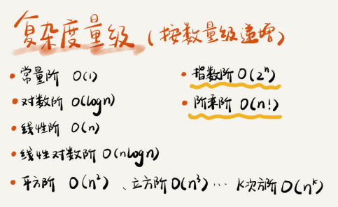
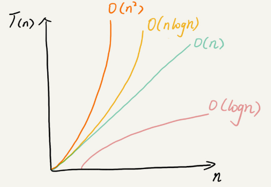

<!--ts-->

复杂度分析

* [一、什么是复杂度分析](#一什么是复杂度分析)
* [二、为什么要进行复杂度分析](#二为什么要进行复杂度分析)
* [三、如何进行复杂度分析](#三如何进行复杂度分析)
   * [1）大 O 复杂度表示法](#1大-o-复杂度表示法)
   * [2）时间复杂度基本分析方法](#2时间复杂度基本分析方法)
   * [3）复杂度量级统计及其直观曲线图](#3复杂度量级统计及其直观曲线图)
   * [4）理解下面的概念](#4理解下面的概念)
   * [5）高级时间复杂度分析方法](#5高级时间复杂度分析方法)

#### 一、什么是复杂度分析 

---

是衡量算法执行效率的一个考量指标和衡量手段。是一种理论分析，实际应用中需要真实运行测试。

#### 二、为什么要进行复杂度分析

---

能够在实际运行代码之前，预测到该算法的执行快慢以及空间的占用率，当然实际测试也是必不可少。

最重要的是，能够在写代码的过程中，提前写好理论最优且更高质量的代码。

#### 三、如何进行复杂度分析

---

##### 1）大 O 复杂度表示法

- **`时间复杂度`**：渐进时间复杂度，表示算法的执行时间与数据规模之间的增长关系，

  常用形式： $O(1)\quad O(logn) \quad O(n) \quad O(nlogn) \quad O(n^2) \quad O(2^n) \quad O(n!)$

- **`空间复杂度`**：渐进空间复杂度，表示算法的存储空间与数据规模之间的增长关系（指除了原本的数据存储空间外，算法运行还需要额外的存储空间 ）。常用形式：$ O(1) \quad O(n) \quad O(n^2)$

$T(n) = O(2n^2 + 2n + 3) = O(n^2)$ 类似这样的化简即为复杂度大 O 表示法。 n 是每行代码的执行次数。

**Note**：所有代码的执行时间 T(n) 与每行代码的执行次数成正比。即每行代码代表一个 unit time。该表示方法不代表真正的执行时间，而是表示代码执行时间随数据规模增长的变化趋势。这也是为什么不同量级复杂度在 n 不同的时候，会有相反的表现。比如 $O(n) $ 与 $O(nlog(n))$ ，在 n 小的时候，在不忽略系数的情况下。很可能 $Onlog(n)$ 代表的算法对应的实际执行时间，要大于 $O(n^2)$ 代表的算法对应的实际执行时间。

##### 2）时间复杂度基本分析方法

- 只关注循环执行次数最多的一段代码
- 加法法则：总复杂度 = 量级最大的那段代码的复杂度
- 乘法法则：嵌套代码的复杂度 = 嵌套内外代码复杂度的乘积

##### 3）复杂度量级统计及其直观曲线图

 
   
   

 

本图片来自极客时间《数据结构与算法之美》专栏
 

##### 4）理解下面的概念

- $O(1$) ：代表常量级，代码执行时间不随 n 的增大而增大，一般情况下，只要算法中不存在循环、递归、即使有成千上万行的代码，其时间复杂度也是 $O(1)$。
- $O(logn)$、$O(nlogn)$
- $O(m+n)$、$O(m*n)$：对于 m + n 这种情况，在不知道 m n 谁大的时候，必须写成这种形式。

##### 5）高级时间复杂度分析方法

除了上面 2）介绍的 [基本复杂度分析](#2时间复杂度基本分析方法) 外，还有如下 4 种复杂度。对于下面前三个复杂度分析，实际中一般情况下不会用到，只有在同一块代码在不同的情况下出现了复杂度有**量级**的差距，才会使用这三种复杂度表示法来区分。

- `最好情况时间复杂度`（best case time complexity）：理想情况下，执行这段代码的时间复杂度。

- `最坏情况时间复杂度`（worst case）：在最糟糕的情况下，执行这段代码的时间复杂度。

- `平均情况时间复杂度`（average case）：加权平均时间复杂度或者期望时间复杂度。

- `均摊时间复杂度`（amortized）： 利用摊还分析法得到的复杂度。这个一般应用在连续时间的有规律的复杂度分析上且大部分情况下复杂度都很低，只有个别情况复杂度比较高，而且这些操作之间存在连贯的时序关系。分析方法例子：如果出现一个 O(n) 复杂度操作后，会连续出现 n-1 次 O(1) 复杂度操作。那么此时可以把 O(n) 耗时多的那次操作均摊到接下来的 n-1 次耗时少的操作上。均摊下来就是 O(1) 复杂度 。

  结论：一般情况下,能够应用均摊时间复杂度分析的场合，均摊时间复杂度就等于最好情况时间复杂度。

  <!--te-->
