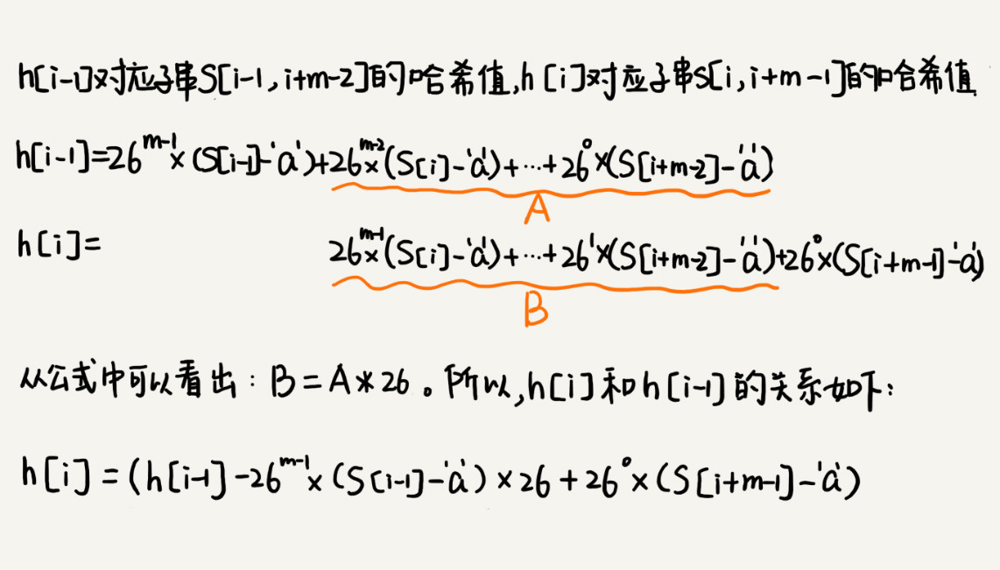

<!--ts-->

字符串匹配

RK 算法是如何借助哈希算法来实现高效字符串匹配的呢？

<对于查找功能是重要功能的软件来说，比如一些文本编辑器，它们的

### 一、什么是字符串匹配

---

在一个主串中查找模式串，通常来说是一个串跟一个串进行匹配。比如 BF 和 RK 算法。也有多模式串的匹配算法，就是在一个串中同时查找多个串。这种是 Trie 树和 AC 自动机。

#### 1 BF 算法

一种暴力简单的字符串匹配算法，就在主串的起始位置开始，一直遍历，每次切换起始位置后，都会与模式串一一对比，假设主串长度为 n，模式串为 m，那么 BF 算法的时间复杂度为 $O(n*m)$。尽管复杂度高，但是在实际应用中用的比较多，一般在串的长度比较小时，效率比较高！

#### 2 RK 算法

在 BF 算法的基础上，减少主串的子串与模式串一一对比消耗的时间，这里用哈希算法来改进，整体就是把子串映射为一个 hash 值，然后与模式串的哈希值进行比较，这样在比较环节就需要遍历一次，其复杂度为 $O(n)$，通常计算子串的哈希值都是要遍历每个子串的元素，如果这样做的话，整体复杂度本身并没有改变，仍然是 $O(n*m)$，我们的目的就是要改进哈希计算时不要把每个子串都遍历一遍。那么需要一个有技巧的 hash 算法，就是把子串的字符按照 a~z 26 个字母，变为 26 进制，这样的哈希算法执行后，每个子串都对应一个唯一的哈希值，可以发现找到的子串 i 与子串 i+1 之间会有部分重叠，只需要计算子串 i 的哈希值，然后通过递推方法就可以得到子串 i+1 的 hash 值。此时，在按照上面新的哈希算法计算哈希值时，就不需要遍历每个子串的元素了，降低了复杂度，此时计算每个子串的哈希值的复杂度就变为了 $O(n)$。所以整体上，先计算哈希值，然后在遍历每个哈希值一一比较，此时整体复杂度为 $O(n)$ ，下图是上面刚刚讲解的 26 进制的例子

 
  
   

 

本图片来自极客时间《数据结构与算法之美》专栏
 

在上面的基础上还会出现一个问题，如果按照 26 进制来计算的话，如果字符串的长度超出 26，或者没有超出 26，但是得到 10 进制值时会超出整型的表示范围，那么我们不得不找到新的哈希算法（可能会增加哈希算法的冲突概率）来降低这种风险。比如举个简单例子，可以把子串的值全部加起来，这个算法当做哈希算法，其值作为哈希值，这样整体表达的整型范围小很多，那么增加了哈希冲突如何解决？我们可以对冲突的子串一一对比每个子元素，这可能也是唯一解决哈希冲突的方法，那么最坏情况下，假设每个子串都哈希冲突，那么我们每个子串都需要一一对比子元素，那么此时的时间复杂度其实就是 $O(n*m)$，但是这样的哈希冲突遇到的概率极低，所以整体来说 RK 算法的效率仍然要好于 BF 算法（当然针对一般的场景，如果主串太小，比如长度为 3，模式串为 2，那么直接用 BF 即可，效率还高）。

#### 3 BM（Boyer-Moore）算法

对于查找功能是重要功能的软件来说，比如一些文本编辑器，它们的查找功能都是用哪种算法来实现的呢？有没有比 BF 算法和 RK 算法更加高效的字符串匹配算法呢？

##### 1 核心思想

在模式串和主串匹配时，如果主串中的某个字符 c 在模式串中是不存在的，那么模式串向后滑动的时候，只要该字符 c 与模式串有重合，肯定无法匹配，那么可以把模式串往后多滑动几位。这样的效率就会提升很快。