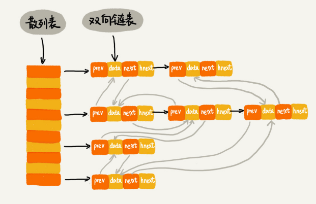

<!--ts-->

<div align = "center"><font size = 4>散列表</font></div>

* [一、什么是散列表](#一什么是散列表)
* [二、设计散列函数及冲突解决方法](#二设计散列函数及冲突解决方法)
  * [1 设计散列函数](#1-设计散列函数)
  * [2 散列冲突解决方案](#2-散列冲突解决方案)
     * [1）开放寻址法](#1开放寻址法)
     * [2）链表法（常用）](#2链表法常用)
* [三、工业级散列表特性及设计方法](#三工业级散列表特性及设计方法)
  * [1）工业级散列表特性](#1工业级散列表特性)
  * [2）如何实现一个散列表](#2如何实现一个散列表)
* [四、散列表和链表结合的例子](#四散列表和链表结合的例子)
* [五、一些技巧和结论](#五一些技巧和结论)


#### 一、什么是散列表

---

散列表是数组的一种扩展，由数组演化而来。用数组支持下标随机访问数据的特性（访问的复杂度为 $O(1)$）。

散列函数（Hash 函数）：将 **关键字** or **键（key）**转化为数组下标的映射方法。

散列函数计算得到的值叫做**散列值**。


#### 二、设计散列函数及冲突解决方法

---

##### 1 设计散列函数

1）构造散列函数基本要求：

- 散列函数计算得到的散列值是一个非负整数
- 如果 key1 = key2，那 hash(key1) == hash(key2);
- 如果 key1 != key2，那 hash(key1) != hash(key2);


2）设计散列函数注意事项

- 散列函数不能太复杂，减少计算散列值的时间。
- 散列函数生成的值尽可能随机且均匀分布—避免或最小化散列冲突，均匀槽位数据量


3）散列函数常用设计方法举例

- 学生运动会分析参赛编号特征，将编号中的后两位作为散列值，叫做数据分析法—根据实际数据，直接选取散列值。

- Word 拼写检查功能。以 "nice" 举例，散列值如下

  ```c++
  hash("nice")=(("n" - "a") * 26*26*26 + ("i" - "a")*26*26 + ("c" - "a")*26+ ("e"-"a")) / 78978
  
  ```

- string 类哈希码原理举例

  ```c++
  // 处理 string 对象哈希码的原理，目前内部设计原理不清楚
  size_t HashCode(const std::string &key) const {
    size_t string_code = 0;
    if (key.size() > 0) {
      for (size_t i = 0; i < key.size(); i++) {
        string_code = string_code * 31 + key[i];
      }
    }
    return string_code;
  }
  
  //! \brief 一个散列函数，返回底层数组索引
  size_t HashFunction(const KeyType &key) const {
    size_t hash = HashCode(key);
    return (hash ^ (hash >> 16)) & (capacity_ - 1);
  }
  ```


##### 2 散列冲突解决方案

###### 1）开放寻址法

如果出现了散列冲突，我们就重新探测一个空闲位置，将其插入。常用探测方法有线性探测（步长为 1）、二次探测（步长为 2）、双重散列（多组散列函数）。


不管哪种探测方法，当散列表中空闲位置不多时，散列冲突的概率会大大提高。导致查找操作接近 $O(n)$ 。一般情况下，尽可能保证散列表中有一定比例的空闲槽位。用装载因子（表中元素个数/散列表长度）表示空位的多少。可以动态扩容装载因子。但是要避免低效率的扩充容量，一般来说，动态扩容，我们在数组中用到过，当数组容量过大时，我们申请 2 倍的内存空间。然后将数据拷贝进去，但是对于散列表来说，当拷贝时，可能会占用太多的时间。如果此代码服务于用户，那么在拷贝的时候明显会有卡顿。


  为了解决上面的一次性扩容，可以非一次性插入所有数据，即分批进行数据插入。因此这个也适用于动态数组的扩容。


**优点：**

  - 可以有效的利用 CPU 缓存加快查询速度。

**缺点：**

  - 所有数据存储在一个数组中，冲突的代价更高。浪费更多的内存空间（因为装载因子的上限不能太大）

**适用情况：**当数据量小、装载因子小的时候，适合采用开放寻址法。比如 ThreadLocalMap 利用开放寻址法解决散列冲突。


###### 2）链表法（常用）

在每个槽位对应一条链表。相同散列值的元素都放到相同槽位对应的链表中。查找和删除操作的时间复杂度。假设有 m 个槽位，n 个数据，那么每个槽位对应的链表长度平均为 k = n/m，所以时间复杂度为 $O(k)$


**缺点：**

- 消耗内存，执行效率低于数组。对 CPU 缓存不友好。

**优点：**

- 灵活，支持更多优化方法，可以将链表改为更加高效的数据结构—跳表、红黑树。即使退化成单个槽位的查询，那么效率也是 $O(logn)$ ，有效避免了散列碰撞攻击。
- 适合存储大对象、大数据量


#### 三、工业级散列表特性及设计方法

---

##### 1）工业级散列表特性

- 支持快速的查询、插入、删除操作
- 内存占用合理，不能浪费过多的内存空间
- 性能稳定，极端情况下，散列表的性能也不会退化到无法接受的情况


##### 2）如何实现一个散列表

- 设计一个合适的散列函数
- 定义装载因子阈值，并且设计动态扩容策略
- 选择合适的散列冲突解决方法


#### 四、散列表和链表结合的例子

---

- LRU 缓存淘汰算法：哈希表 + 双链表

  - 往缓存中添加一个数据：$O(1)$
  - 从缓存中删除一个数据：$O(1)$
  - 在缓存中查找一个数据：$O(1)$

  原理如下：

  <div align = "center"> 
     
  </div><br>
  <div align = "center"><font size = 2>本图片来自极客时间《数据结构与算法之美》专栏</font></div></br>

- Redis 有序集合：哈希表 + 跳表
- Java LinkedHashMap：哈希表 + 双链表，与 LRU 缓存淘汰算法一致


**问题：**为什么要用散列表和双链表一块使用？

>散列表支持高效的数据插入、删除、查找操作。但是内部是无序的。如果我们想要顺序遍历数据。那么可以通过维护另一个双链表（or 跳表）结构来记录顺序。


#### 五、一些技巧和结论

---

- A % B = A & (B-1) 成立条件：B 是 2 的指数。

- 数组占据随机访问的优势，却有需要连续内存的缺点。

  链表具有可不连续存储的优势，但访问查找是线性的。

  散列表和链表、跳表的混合使用，是为了结合数组和链表的优势，规避它们的不足。

  我们可以得出数据结构和算法的重要性排行榜：连续空间 > 时间 > 碎片空间。

<!--te-->

