<!--ts-->

<div align = "center"><font size = 4>二叉树</font></div>

* [一、二叉树基础（上）](#一、二叉树基础（上）)

   * [1 树的基本概念](#1 树的基本概念)
   * [2 二叉树种类](#2 二叉树种类)
   * [3 二叉树存储方式](#3-二叉树存储方式)
   * [4 二叉树的遍历及其递归（O(n)）实现](#4-二叉树的遍历及其递归（O(n)）实现)
   * [5 课后思考题](#5-课后思考题)
* [二、二叉树基础（下）— 二叉查找树 or 二叉排序树](#二、二叉树基础（下）— 二叉查找树 or 二叉排序树)

   * [1 二叉查找树概念（Binary Search Tree）](#1 二叉查找树概念（Binary Search Tree）)
   * [2 二叉查找树—查找](#2 二叉查找树—查找)
   * [3 二叉查找树—插入](#3 二叉查找树—插入)
   * [5 二叉查找树的其他操作](#5 二叉查找树的其他操作)
   * [6 支持重复数据的二叉查找树](#6 支持重复数据的二叉查找树)
   * [7 二叉查找树的时间复杂度分析](#7 二叉查找树的时间复杂度分析)
   * [8 散列表 vs 二叉查找树](#8 散列表 vs 二叉查找树)
   * [9 练习](#9 练习)

- [三、红黑树](#三、红黑树)
  - [1 什么是"平衡二叉查找树"](#1 什么是"平衡二叉查找树")
  - [2 为什么需要平衡二叉查找树](#2 为什么需要平衡二叉查找树)
  - [3 红黑树要点](#3 红黑树要点)
  - [4 实现红黑树的基本思想](4 实现红黑树的基本思想)
  - [5 动态数据结构比较](#5 动态数据结构比较)
- [四、递归树](#四、递归树)
  - [1 什么是递归树](#1 什么是递归树)
  - [2 递归树分析实例](#2 递归树分析实例)
    - [归并排序](#归并排序)
    - [快速排序](#快速排序)
    - [斐波那契数列](#斐波那契数列)
    - [全排列](#全排列)
  - [3 注意及思考题](#3 注意及思考题)


#### 一、二叉树基础（上）

---

<font color="green">二叉树有哪几种存储方式？什么样的二叉树适合用数组来存储？</font>


##### 1 树的基本概念

- 父节点、子节点、兄弟节点、根节点（树根）、叶子节点/叶节点（没有子节点的节点）。

- 高度（节点到叶子节点的最长边数）、深度（根节点到该节点的边数）、层（节点的深度+1）、树的高度（根节点到叶子节点最长边数）

  <div align = "center"> 
    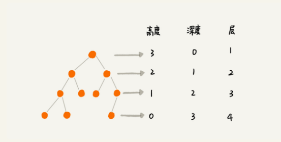 
  </div><br>
  <div align = "center"><font size = 2>本图片来自极客时间《数据结构与算法之美》专栏</font></div></br>

##### 2 二叉树种类

- 普通的二叉树：除了下面外的其他二叉树，都是普通二叉树。

- 满二叉树：叶子节点全部在最底层，除了叶子节点外，每个节点都有左右两个子节点。（一种特殊的完全二叉树）

  <div align = "center"> 
    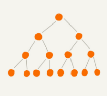 
  </div><br>
  <div align = "center"><font size = 2>本图片来自极客时间《数据结构与算法之美》专栏</font></div></br>

- 完全二叉树：叶子节点在最底下二层，最后一层的叶子节点都靠左排列，除了最后一层节点外，其他层节点个数达到最大！

  <div align = "center"> 
    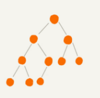 
  </div><br>
  <div align = "center"><font size = 2>本图片来自极客时间《数据结构与算法之美》专栏</font></div></br>

##### 3 二叉树存储方式

- 链式存储：基于链表的方法，每个节点 3 个元素，一个存储数据，另两个存储指针。
- 顺序存储：基于数组的存储方法。会牺牲一个空间，在数组索引 0 位置处。在 1 位置处是表明根节点！


##### 4 二叉树的遍历及其递归（O(n)）实现

- 前序遍历：先打印该节点，然后打印其左子树，再打印右子树。
- 中序遍历：先打印左子树，在打印该节点，在打印右子树。
- 后序遍历：先打印左子树，在打印右子树，在打印该节点。

```c++
前序遍历的递推公式：
preOrder(r) = print r->preOrder(r->left)->preOrder(r->right)

中序遍历的递推公式：
inOrder(r) = inOrder(r->left)->print r->inOrder(r->right)

后序遍历的递推公式：
postOrder(r) = postOrder(r->left)->postOrder(r->right)->print r
```


##### 5 课后思考题

1. 二叉树的层序遍历实现？


#### 二、二叉树基础（下）— 二叉查找树 or 二叉排序树

---

支持动态数据集合快速插入、删除、查找操作。那么这里应该是基于链表的存储方式！

<font  color="green">既然有了这么高效的散列表（O(1)），使用二叉树的地方是不是都可以替换成散列表呢？有没有其他哪些地方散列表做不了，必须要用二叉树来做的呢？</font>


##### 1 二叉查找树概念（Binary Search Tree）

要求：在树中任意一个节点，左子树中每个节点的值 < 该节点的值，而右子树的节点值 > 该节点的值。

<div align = "center"> 
  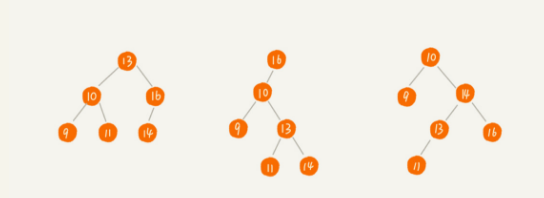 
</div><br>
<div align = "center"><font size = 2>本图片来自极客时间《数据结构与算法之美》专栏</font></div></br>

##### 2 二叉查找树—查找

根据二叉查找树基本概念，我们可以根据类似二分的思想，在左子树和右子树中递归查找。当然实现方式可以直接用循环！


##### 3 二叉查找树—插入

与上面查找相似，同样是类似二分思路来插入数据，只不过需要提前判断右（左）子节点是不是为空，如果是空，直接插入返回即可。


##### 4 二叉查找树—删除

- 第一种情况，删除的节点没有子节点，那么直接将该节点删除即可（但是要注意清除父亲节点的相应指针（左子节点 or 右子节点））。
- 第二种情况，删除的节点有一个子节点，那么直接让其父节点指向该节点的子节点！
- 第三种情况，删除的节点有两个子节点，那么需要找到该节点的右子树中的最小值，然后将该值替换到要删除的节点位置，然后删除最小值对应的节点（记住要清零其父亲节点内部的某个指针，还要判断他有没有右儿子节点！）。

下面专栏的代码实现的就比较好

```java
public void delete(int data) {
  Node p = tree; // p 指向要删除的节点，初始化指向根节点
  Node pp = null; // pp 记录的是 p 的父节点
  while (p != null && p.data != data) {
    pp = p;
    if (data > p.data) p = p.right;
    else p = p.left;
  }
  if (p == null) return; // 没有找到

  // 要删除的节点有两个子节点
  if (p.left != null && p.right != null) { // 查找右子树中最小节点
    Node minP = p.right;
    Node minPP = p; // minPP 表示 minP 的父节点
    while (minP.left != null) {
      minPP = minP;
      minP = minP.left;
    }
    p.data = minP.data; // 将 minP 的数据替换到 p 中
    p = minP; // 下面就变成了删除 minP 了 ，即使他有右儿子节点，下面也能够处理！
    pp = minPP;
  }

  // 删除节点是叶子节点或者仅有一个子节点
  Node child; // p 的子节点
  if (p.left != null) child = p.left;
  else if (p.right != null) child = p.right;
  else child = null;
	// 注意这个 java 版本没有内存的释放操作！
  if (pp == null) tree = child; // 删除的是根节点
  else if (pp.left == p) pp.left = child;
  else pp.right = child;
}
```


##### 5 二叉查找树的其他操作

除了上面的插入、删除、查找外，还有快速查找最大节点、最小节点、前驱节点、后继节点。**重要特性**：**中序遍历二叉查找树，可以输出有序的数据序列（小->大），时间复杂度为 $O(n)$，非常高效！**可以利用堆栈存储中序遍历结果得到从大到小的输出！这样空间复杂度就是 $O(n)$。


##### 6 支持重复数据的二叉查找树

上面的操作每个节点存储的数据都是单个数值 ，但是实际操作过程中，会利用对象的某个字段作为键值（Key）来构建二叉查找树，把对象的其他字段叫做**卫星数据**。 这样就有可能会有重复的数据（键值 Key）。解决方案：

- 在二叉查找树中每个节点除了存储键值外，还要保留一个动态扩容的数组或者链表来存储对像的卫星数据。
- 每个节点只存储一个数据（键值 + 卫星数据），在查找插入时，对于重复元素，我们把按照插入的方法，将其插入到右子树中，其实就是插入到最左子节点处！当要查找数据时，遇到键值相同的节点后仍然需要在其右子树中继续查找（只要查找左子节点即可！），直到遇到空！这样就把所有键值相同的节点找到。对于删除，我们直接按照上面讲解的普通二叉查找数的删除方法依次删除即可！


##### 7 二叉查找树的时间复杂度分析

不同树的形状，会影响复杂度，比如下面图片的三种情况

<div align = "center"> 
  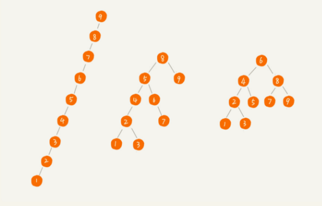 
</div><br>
<div align = "center"><font size = 2>本图片来自极客时间《数据结构与算法之美》专栏</font></div></br>

时间复杂度与树的高度成正比，也就是 $O(height) = O(L-1)$，L 代表树有多少层。可以根据下面方法计算高度关于节点总个数的关系，即可推导处 L 关于节点个数 n 的关系式。L~ [log2(n+1), log2n +1]

```
n >= 1+2+4+8+...+2^(L-2)+1
n <= 1+2+4+8+...+2^(L-2)+2^(L-1)
```

一般情况下，树不是完全二叉树，那么其时间复杂度就会增高，下面就会讲解平衡二叉树使得插入、删除、查找操作的时间复杂度为 $O(logn)$。


##### 8 散列表 vs 二叉查找树

1. 散列表数据是无序的，如果要有序遍历，那么需要先排序，二叉查找树直接可以在 $O(n)$ 复杂度下有序输出
2. 散列表扩容耗时多，且遇到散列冲突时，性能非常不稳定，尽管二叉查找树性能不稳定，但是实际使用时都会用平衡二叉树，其比较稳定，删除、查找、插入的时间复杂度为 $O(logn)$。
3. 尽管散列表查找是常量级的，但是因为哈希冲突的存在（需要遍历链表或者数组），这个常量不一定要比 $O(logn)$ 小，所以实际查找速度可能不一定比 $O(logn)$ 快，加上哈希函数耗时，也不一定就比平衡二叉树效率高！
4. 散列表构造复杂（散列函数设计、冲突解决方案、扩容、缩容），平衡二叉树只需要平衡性这一个问题。且已经有成熟的方案。
5. 为了避免过多的散列冲突，散列表装载因子不能太小，特别是基于开放寻址法解决冲突的散列表，所以会浪费空间。

综合考虑，平衡二叉树在某些方面还是优于散列表的


##### 9 练习

leetcode 538：

leetcode 450：二叉查找树的删除操作

leetcode 104：二叉查找树的的高度计算

leetcode 102： Binary Tree Level Order Traversal（层序遍历方法）

输出二叉树的确切高度（递归和层序遍历方法）、二叉搜索树的构建（查找、删除、插入、支持重复数据的二叉查找树）、二叉树的遍历（前序、中序、后序遍历、层序遍历）。


#### 三、红黑树

---

<font color="green">为什么工程中都喜欢用红黑树，而不是其他平衡二叉查找树呢？</font>


##### 1 什么是"平衡二叉查找树"

**平衡性**：二叉树中任意一个节点的左右子树的高度相差不能大于 1。

**查找性**：每个节点值大于左子节点，小于右子节点


比如：完全二叉树、满二叉树都是平衡二叉树，但是非完全二叉树也有可能是平衡二叉树。一些比较著名的平衡二叉查找树有 AVL 树、红黑树、Splay Tree（伸展树）、Treap（树堆）。

优点：使得整棵树达到左右接近对称，使得整棵树高度低一些，这样插入、删除、查找的效果一般保持在 O(logn)


##### 2 为什么需要平衡二叉查找树

主要是为了让二叉搜索树的高度维持在 $log_2(n)$ 的附近，保持插入、删除、查找的时间复杂度在 $O(log(n))$。


##### 3 红黑树要点

- 根节点是黑色的
- 每个叶子节点都是黑色的空节点（NIL），也就是说叶子节点不存储数据（为了简化红黑树的代码实现）
- 任何相邻的节点不能同时为红色，也就是说，红色节点是被黑色节点隔开的
- 每个节点，从该节点到达其可达节点的所有路径，都包含相同数目的黑色节点

红黑树是「近似平衡」的（性能不会退化太严重），其高度只比高度平衡的 AVL 数的高度（$log_2(n)$）大了一倍，但是在实际性能中，红黑树的性能更好！因为其维护「近似平衡」的代价上比 AVL 数低。


##### 4 实现红黑树的基本思想

本质就是围绕着红黑树要点，针对当前树的结构，按照规则做几次操作：左旋、右旋。包含如下两种情况

- 插入操作的平衡调整策略
- 删除操作的平衡调整策略（一次调整（针对要删除的节点，解决第四条要点） + 二次调整（解决一次调整带来的第三条要点不满足））


##### 5 动态数据结构比较

**动态数据结构定义**：支持动态的更新操作，里面存储的数据是时刻在变化的，重要的是删除、插入、查询等这些效率都要非常高（低于 O(n)）

**散列表**：插入删除查找都是 O(1)，是最常用的，但其缺点是不能顺序遍历以及扩容缩容的性能损耗。适用于那些不需要顺序遍历，**数据更新不那么频繁**的，**其顺序查找效率不太好，随机效果好**

**跳表**：插入删除查找都是 O(logn)，并且能顺序遍历。缺点是空间复杂度 O(n)。适用于不那么在意内存空间的，其顺序遍历和区间查找非常方便。

**红黑树**：插入删除查找都是 O(logn)，中序遍历即是顺序遍历，稳定。缺点是难以实现，去查找不方便。其实跳表更佳，但红黑树已经用于很多地方了，**用于数据更新频繁**。


#### 四、递归树

---

<font color="green">借助递归树来分析递归算法的时间复杂度</font>

在插入和归并排序中，用到的递归算法是直接根据递推公式来计算时间复杂度！


##### 1 什么是递归树

将递归函数调用顺序按照树的节点一层一层来表示。如下图

<div align = "center"> 
  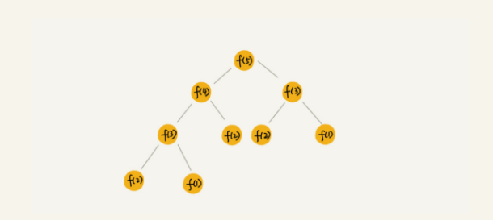 
</div><br>
<div align = "center"><font size = 2>本图片来自极客时间《数据结构与算法之美》专栏</font></div></br>

我们只要分析递归形成的树的高度即可得到时间复杂度。


##### 2 递归树分析实例

主要把每一层的消耗计算出来，然后把所有层的消耗计算出来就是时间复杂度了


###### 归并排序

每一层递归都需要合并，而合并需要 n 次基本操作。所以总复杂度就是 $n*O(height)$，而高度根据这里的计算可以得到 $\dfrac{n}{2^k} = 1$ 可以推出高度为 $log_2(n)$，因此归并排序的时间复杂度为 $O(nlog(n))$。

<div align = "center"> 
  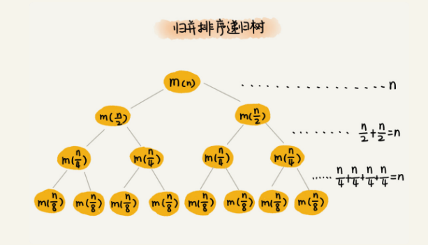 
</div><br>
<div align = "center"><font size = 2>本图片来自极客时间《数据结构与算法之美》专栏</font></div></br>

###### 快速排序

这里其实与归并排序思路差不多，只不过快速排序需要找到分区点，然后根据分区点划分为两个区间，然后在每个区间再次进行排序。假设每次的分区点将区间都划分 1:k，这里 k = 9，那么第一次划分（消耗遍历 n 次）后，两个区间的长度就是 n/10, 9n/10，两个区间在找分区点，那么两个区间的消耗和就是 n/10 + 9n/10 = n，也就是说树的每一 层的消耗和仍然是 n，也就是说我们只需要计算树的高度，就能得到时间复杂度。因为 1/10 和 9/10 两次的递减的速度不一样，那么最长路径就对应着 9/10，最短路径对应 1/10。可以得到高度的区间如下，之后在乘以 n，即可得到所有的消耗和，平均来说时间复杂度就是 $O(log(n))$。

<div align = "center"> 
  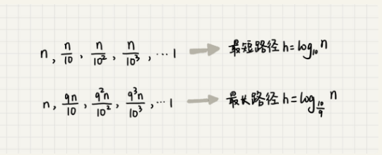 
  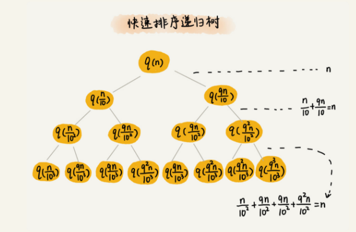 
</div><br>
<div align = "center"><font size = 2>本图片来自极客时间《数据结构与算法之美》专栏</font></div></br>

###### 斐波那契数列

递推公式: f(n-1) + f(n-2);  if (n == 1) return 1; if (n == 2) return 2;

从递推公式就可以看出，第一层的消耗就是 f(n-1) + f(n-2) 求和，设此时加法操作的消耗单位为 1。那么第 2 层的消耗为 2。根据 $2^0 \, 2^1 \, 2 ^2 , \cdots $，下面在看该树有多少层，最长路径为 n-1 这条对应为 n-1，最短路径为 n - 2 这条对应为 n/2，那么上面求和，最长为 $1 + 2 + 2^2 + \cdots + 2^{n-1} = 2^n - 1$ 最短路径为 $1 + 2 + 2^2 + \cdots + 2^{n/2} = 2^{(n/2)-1}$，至此，可以直接说出该时间复杂度是指数级的，为 $O(2^n)$。

<div align = "center"> 
  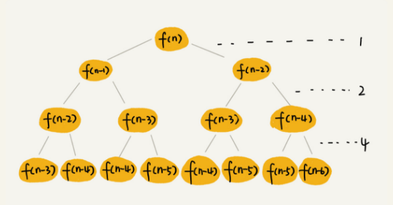 
</div><br>
<div align = "center"><font size = 2>本图片来自极客时间《数据结构与算法之美》专栏</font></div></br>

###### 全排列

这个比较复杂，其实可以直接从代码中查看对应的消耗。代码中消耗部分就是交换操作，开始的时候会有 n 次交换，这里可以看下下面的图片，第一层消耗就是 n ，那么第二层就是 n (n-1)，因为 f(n-1) 对应有还有 n-1 个数字，那么总共就会有 n(n-1) 次交换，依次类推，一直到 n(n-1)...(n-k+1) 这个是在第 k 层。最后只有 1 次消耗，也就是 n-k+1 = 1，此时可以计算出 k = n，总共有 n 层。那么所有层求和就是 sum = n + n(n-1) + ... + n(n-1)...(n-k+1)1，此时这里 n! < sum < n x n!，所以复杂度介于这两个之间，反正是比较大！


递推公式

> 假设数组中存储的是 1，2， 3...n。
> f(1,2,...n) = {最后一位是 1, f(n-1)} + {最后一位是 2, f(n-1)} +...+{最后一位是 n, f(n-1)}。

代码

```java
// 调用方式：
// int[]a = a={1, 2, 3, 4}; printPermutations(a, 4, 4);
// k 表示要处理的子数组的数据个数
public void printPermutations(int[] data, int n, int k) {
  if (k == 1) {
    for (int i = 0; i < n; ++i) {
      System.out.print(data[i] + " ");
    }
    System.out.println();
  }

  for (int i = 0; i < k; ++i) {
    int tmp = data[i];
    data[i] = data[k-1];
    data[k-1] = tmp;

    printPermutations(data, n, k - 1);

    tmp = data[i];
    data[i] = data[k-1];
    data[k-1] = tmp;
  }
}

```

<div align = "center"> 
  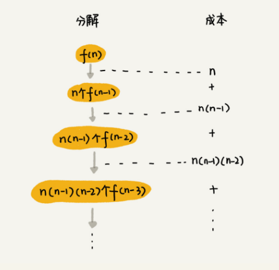 
</div><br>
<div align = "center"><font size = 2>本图片来自极客时间《数据结构与算法之美》专栏</font></div></br>

##### 3 注意及思考题

分析递归代码的复杂度有两种方法：一个是排序讲解的递推公式入手，一个是当前学习的递归树，从代码实现入手。要在适合的地方用合适的方法。


1 个细胞的生命周期是 3 小时，1 小时分裂一次。求 n 小时后，容器内有多少细胞？请你用已经学过的递归时间复杂度的分析方法，分析一下这个递归问题的时间复杂度。

**答案**：本题只要把递推公式列出来，就可以从递归树的角度来分析复杂度。可以这样想，f(n) = 2 * f(n-1) - 【n 时刻点死掉的细胞数量】，f(n-3) 时刻的细胞在 n 时就会死掉（到点就死，不会分裂）。到这里 f(n) = 2*f(n-1) - f(n-3，递推公式的时间复杂度其实与斐波那契数列的分析就一样了，就是指数级别。


<font color="green">建议大家也可以去尝试一下 leetcode 46 题在学完 backtracking 之后！然后尝试着自己分析一下时间复杂度</font>