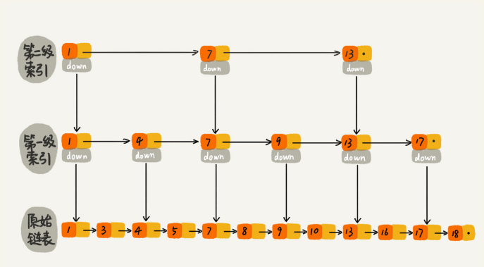

<!--ts-->

跳表

* [一、什么是跳表](#一什么是跳表)
* [二、如何理解跳表结构](#二如何理解跳表结构)
* [三、跳表复杂度分析](#三跳表复杂度分析)
* [四、一些问题](#四一些问题)

#### 一、什么是跳表

---

一种动态的数据结构，底层是链表（加上多级索引层）。支持快速的插入、删除、查找操作。

#### 二、如何理解跳表结构

---

实际上就是在单链表的基础上，建立多个索引层，通过遍历高索引层，到低索引层，最终确定要查找的值。如下图所示

 
   

 

本图片来自极客时间《数据结构与算法之美》专栏
 

#### 三、跳表复杂度分析

---

- 时间复杂度

  假设链表节点个数为 n，那么每层索引按照间隔 2 个节点划分，第 1 级索引为 n/2，第二级索引为 n/4 依次类推，最后为 $n/2^k$ ，如果最后一层为 2 个节点，那么 $n/2^k = 2$，此时可以计算出 $k = log_2(n) - 1$ 总共有 k 层，假设查找时，每一层都会遍历，且每一层遍历 m 个节点。那么需要遍历 k 层，则时间复杂度为 $O(mk) = O(mlog(n))$，现在来确定 m 的个数，实际上，每一层最多只遍历 3 个节点，因此这里的复杂度为 $O(3log(n)) = O(log(n))$ 因此复杂度就是与基于数组的二分相同。

- 空间复杂度

  根据上面的分析，总共 k 层，每层对应节点数为 $n/2^k$，求和为 (n-1)。所以空间复杂度为 $O(n)$

对于空间复杂度来说，在实际使用时，索引占用的空间仅仅是一些关键值和指向底层节点的指针，如果数据本身空间大于这些索引空间，那么索引空间其实可以忽略。跳表插入和删除复杂度与查找复杂度一致，都是 $O(logn)$。当插入数据过多时，还要考虑数据结构的动态更新问题，要用到随机函数生成的值K来表示要插入的值同时插入到k级索引中。随机函数需要自己来根据兴趣了解。

#### 四、一些问题

---

1）为什么 Redis 要用跳表来实现？

Redis 中的有序集合是通过跳表和散列表来实现的。虽然插入、删除、查找和迭代输出有序序列这几个操作，红黑树也能完成且时间复杂度一样，但是按照区间来查找数据这个操作跳表效率更高。

<!--te-->